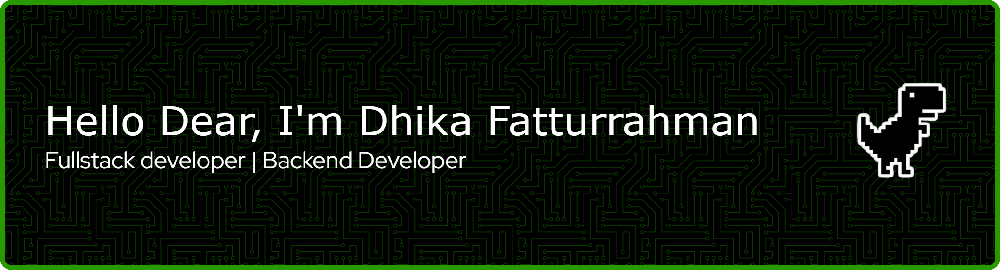

<div align="center">
  
</div>

<div align="center">

[](https://git.io/typing-svg)

</div>

---

## 👨‍💻 About Me

> _My name is **Dhika Fatturrahman Ghany**, a 12th-grade student at SMK Negeri 1 Cimahi, currently undergoing an internship at **PT Infinys System Indonesia** as a Backend Developer Intern._

```yaml
name      : Dhika Fatturrahman Ghany
location  : Bandung, Indonesia 📍
school    : SMK Negeri 1 Cimahi
internship: PT Infinys System Indonesia — Backend Developer Intern
focus     : Full Stack · Backend · Frontend · DevOps
status    : Always building, always learning
```

---

## 🛠️ Tech Stack & Tools

**Languages**

<p align="center">
  <a href="https://skillicons.dev">
    
  </a>
</p>

**Frontend**

<p align="center">
  <a href="https://skillicons.dev">
    
  </a>
</p>

**Backend**

<p align="center">
  <a href="https://skillicons.dev">
    
  </a>
  
</p>

**DevOps & Tools**

<p align="center">
  <a href="https://skillicons.dev">
    
  </a>
</p>

---

## 📬 Contact Me

<div align="center">

[](https://www.instagram.com/dhikaa.gh/)
[](https://www.linkedin.com/in/dhika-fatturrahman-ghany-5b8b33318)
[](mailto:dhikagh12@gmail.com)
[](#)

</div>

---

## 🚀 Projects

<div align="center">

[](https://github.com/dhikaagh/your-repo-1)
[](https://github.com/dhikaagh/your-repo-2)

</div>

> 💡 _Check out all my projects in [my repositories](https://github.com/dhikaagh?tab=repositories)_

---

## 📊 GitHub Stats

<div align="center">


[](https://git.io/streak-stats)

</div>

---

<div align="center">


**Thanks for visiting! Have a great day 🙌**


</div>
