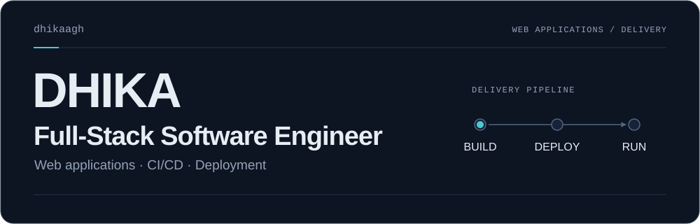

# Full-Stack Software Engineer

I build full-stack web applications and APIs, with hands-on experience in CI/CD, VPS deployment, and server management.

Based in Cimahi, Indonesia.

## Selected work

### [PaymentKit](https://github.com/dhikaagh/paymentkit)

A payment API with asynchronous processing, containerized services, and a GitHub Actions deployment workflow.

**My contribution:** API/worker development and the GitHub Actions deployment workflow.

- **Stack:** TypeScript · Node.js · Hono · RabbitMQ · MySQL
- **Delivery:** Docker · GitHub Actions · VPS deployment

### [Messaging Bridge](https://github.com/dhikaagh/Messaging-Bridge-)

An API for integrating Telegram, email, and WhatsApp messaging.

**My contribution:** API routing and OpenAPI documentation.

**Stack:** TypeScript · Bun · Hono · Zod

## Development & delivery

- Build web applications across the frontend and backend.
- Work with CI/CD workflows in GitHub Actions and GitLab CI/CD.
- Deploy applications and manage server/VPS environments.
- Use Docker for basic containerized development and deployment.

## Tools

- **Frontend:** React · Next.js · Tailwind CSS
- **Backend:** Node.js · Hono · Laravel
- **Languages & data:** JavaScript · TypeScript · PHP · MySQL · PostgreSQL · RabbitMQ
- **Delivery:** GitHub Actions · GitLab CI/CD · Docker (basics) · Linux · Git

## Contact

[LinkedIn](https://www.linkedin.com/in/dhika-fatturrahman-ghany-5b8b33318) · [Email](mailto:dhikagh12@gmail.com)
